# Canonical Data Model v0.1 — Diagrama ER

**Entidades:** 23 · **Esquemas:** `regulatory`, `operational`, `intelligence`
**Fuente de verdad:** `database/models/` — este diagrama se regenera desde
`Base.metadata`, no se edita a mano.

---

## 1. Campos transversales (en casi todas las tablas, omitidos del diagrama)

| Bloque | Columnas | Dónde |
|---|---|---|
| `UUIDPrimaryKeyMixin` | `id` (UUID, `gen_random_uuid()`) | todas |
| `TimestampMixin` | `created_at`, `updated_at` (TIMESTAMPTZ) | todas |
| `DataOriginMixin` | `data_origin` (CHECK 5 valores), `source_id` → `regulatory.legal_sources` | toda tabla de negocio |
| `RegulatoryMixin` | `published_at`, `valid_from`, `valid_to`, `source_url`, `source_document`, `content_hash`, `retrieved_at` | esquema `regulatory` (salvo `legal_sources`) |
| `AIDecisionMixin` | `model_provider`, `model_name`, `prompt_version`, `confidence`, `requires_human_review` | `product_dnas`, `classification_decisions`, `risk_findings`, `opportunity_findings` |
| `SyntheticMixin` | `synthetic_scenario_id` → `operational.synthetic_scenarios`, `seed` | esquema `operational` + tablas de IA + `ground_truth_records` |

`valid_to IS NULL` = **sigue vigente**. Nunca se inventa una fecha de fin (§5 CLAUDE.md).

---

## 2. Diagrama

```mermaid
erDiagram
    legal_documents ||--o{ legal_rules : legal_document_id
    legal_documents ||--o{ tariff_fractions : legal_document_id
    clients ||--o{ invoices : client_id
    suppliers ||--o{ invoices : supplier_id
    clients ||--o{ pedimentos : client_id
    clients ||--o{ products : client_id
    suppliers ||--o{ products : supplier_id
    tariff_fractions ||--o{ nicos : tariff_fraction_id
    evidence_records ||--o{ product_dnas : evidence_id
    products ||--o{ product_dnas : product_id
    invoices ||--o{ coves : invoice_id
    invoices ||--o{ invoice_items : invoice_id
    products ||--o{ invoice_items : product_id
    evidence_records ||--o{ classification_decisions : evidence_id
    nicos ||--o{ classification_decisions : nico_id
    product_dnas ||--o{ classification_decisions : product_dna_id
    products ||--o{ classification_decisions : product_id
    tariff_fractions ||--o{ classification_decisions : tariff_fraction_id
    evidence_records ||--o{ product_attributes : evidence_reference
    product_dnas ||--o{ product_attributes : product_dna_id
    invoice_items ||--o{ pedimento_items : invoice_item_id
    nicos ||--o{ pedimento_items : nico_id
    pedimentos ||--o{ pedimento_items : pedimento_id
    products ||--o{ pedimento_items : product_id
    tariff_fractions ||--o{ pedimento_items : tariff_fraction_id
    classification_decisions ||--o{ classification_candidates : classification_decision_id
    tariff_fractions ||--o{ classification_candidates : tariff_fraction_id
    pedimentos ||--o{ ground_truth_records : pedimento_id
    pedimento_items ||--o{ ground_truth_records : pedimento_item_id
    evidence_records ||--o{ opportunity_findings : evidence_id
    pedimentos ||--o{ opportunity_findings : pedimento_id
    pedimento_items ||--o{ opportunity_findings : pedimento_item_id
    products ||--o{ opportunity_findings : product_id
    classification_decisions ||--o{ risk_findings : classification_decision_id
    evidence_records ||--o{ risk_findings : evidence_id
    pedimentos ||--o{ risk_findings : pedimento_id
    pedimento_items ||--o{ risk_findings : pedimento_item_id

    legal_sources {
        uuid id PK
        string slug
        text name
        text authority
        string jurisdiction
        enum kind
        text base_url
        text notes
    }
    evidence_records {
        uuid id PK
        string subject_kind
        uuid subject_id
        text summary
        array source_ids
        array legal_rule_ids
        jsonb document_refs
        array content_hashes
        text engine_version
        string created_by
        enum data_origin
    }
    synthetic_scenarios {
        uuid id PK
        string slug
        text name
        text description
        text generator_version
        jsonb parameters
        enum data_origin
    }
    legal_documents {
        uuid id PK
        text title
        string short_name
        enum kind
        string document_number
        string language
        text reform_reference
        text full_text
        enum data_origin
        date published_at
        date valid_from
        date valid_to
        text source_url
        text source_document
        text content_hash
        date retrieved_at
    }
    regulatory_events {
        uuid id PK
        text title
        text authority
        enum event_kind
        date effective_date
        text summary
        array keywords
        array affected_fraction_codes
        array affected_rule_ids
        enum data_origin
        date published_at
        date valid_from
        date valid_to
        text source_url
        text source_document
        text content_hash
        date retrieved_at
    }
    clients {
        uuid id PK
        text legal_name
        string rfc
        string country
        text industry
        jsonb address
        bool is_active
        enum data_origin
    }
    suppliers {
        uuid id PK
        text legal_name
        string tax_id
        string country
        text manufacturer_name
        bool is_manufacturer
        jsonb address
        enum data_origin
    }
    legal_rules {
        uuid id PK
        uuid legal_document_id FK
        string rule_number
        text path
        text heading_text
        text text
        string rgi_reference
        enum data_origin
        date published_at
        date valid_from
        date valid_to
        text source_url
        text source_document
        text content_hash
        date retrieved_at
    }
    tariff_fractions {
        uuid id PK
        uuid legal_document_id FK
        string code
        string chapter
        string heading
        string subheading
        text description
        string unit
        numeric igi_rate
        numeric ige_rate
        enum data_origin
        date published_at
        date valid_from
        date valid_to
        text source_url
        text source_document
        text content_hash
        date retrieved_at
    }
    invoices {
        uuid id PK
        uuid client_id FK
        uuid supplier_id FK
        string invoice_number
        date invoice_date
        string incoterm
        char currency
        numeric subtotal_amount
        char subtotal_amount_currency
        numeric freight_amount
        char freight_amount_currency
        numeric insurance_amount
        char insurance_amount_currency
        numeric total_amount
        char total_amount_currency
        enum data_origin
    }
    pedimentos {
        uuid id PK
        uuid client_id FK
        string pedimento_number
        string customs_office
        string pedimento_key
        string regime
        enum trade_flow
        date operation_date
        date entry_date
        char currency
        numeric exchange_rate
        numeric customs_value
        char customs_value_currency
        numeric total_taxes
        char total_taxes_currency
        bool is_simulation
        enum data_origin
    }
    products {
        uuid id PK
        uuid client_id FK
        uuid supplier_id FK
        string sku
        text commercial_name
        text description
        text brand
        text model
        text manufacturer_name
        string country_of_manufacture
        string unit_of_measure
        enum data_origin
    }
    nicos {
        uuid id PK
        uuid tariff_fraction_id FK
        string code
        string full_code
        text description
        text correlation
        enum data_origin
        date published_at
        date valid_from
        date valid_to
        text source_url
        text source_document
        text content_hash
        date retrieved_at
    }
    product_dnas {
        uuid id PK
        uuid product_id FK
        uuid evidence_id FK
        int version
        bool is_current
        array input_kinds
        text summary
        array missing_information
        enum data_origin
    }
    coves {
        uuid id PK
        uuid invoice_id FK
        string cove_number
        string cove_type
        date issued_at
        text edocument_hash
        enum data_origin
    }
    invoice_items {
        uuid id PK
        uuid invoice_id FK
        uuid product_id FK
        int line_number
        text description
        numeric quantity
        string unit_of_measure
        string country_of_origin
        numeric unit_price
        char unit_price_currency
        numeric line_total
        char line_total_currency
        enum data_origin
    }
    classification_decisions {
        uuid id PK
        uuid product_id FK
        uuid product_dna_id FK
        uuid tariff_fraction_id FK
        uuid nico_id FK
        uuid evidence_id FK
        enum trade_flow
        date operation_date
        enum status
        string chapter
        string heading
        string subheading
        string fraction_code
        string nico_code
        text reasoning
        array rgi_path
        array legal_rule_ids
        text engine_version
        jsonb input_snapshot
        array missing_information
        numeric estimated_impact_amount
        char estimated_impact_amount_currency
        enum data_origin
    }
    product_attributes {
        uuid id PK
        uuid product_dna_id FK
        uuid evidence_reference FK
        string name
        text value
        string unit
        enum status
        enum data_origin
    }
    pedimento_items {
        uuid id PK
        uuid pedimento_id FK
        uuid product_id FK
        uuid invoice_item_id FK
        uuid tariff_fraction_id FK
        uuid nico_id FK
        int line_number
        text description
        string declared_fraction_code
        string declared_nico_code
        numeric quantity
        string commercial_unit
        string country_of_origin
        numeric customs_value
        char customs_value_currency
        numeric igi_amount
        char igi_amount_currency
        numeric vat_amount
        char vat_amount_currency
        array applied_nom_codes
        jsonb identifiers
        enum data_origin
    }
    classification_candidates {
        uuid id PK
        uuid classification_decision_id FK
        uuid tariff_fraction_id FK
        int rank
        string fraction_code
        string nico_code
        text reasoning
        bool is_selected
        text rejected_reason
        enum data_origin
    }
    ground_truth_records {
        uuid id PK
        uuid pedimento_id FK
        uuid pedimento_item_id FK
        enum error_type
        text original_value
        text mutated_value
        bool expected_detection
        string expected_field
        enum expected_severity
        enum data_origin
    }
    opportunity_findings {
        uuid id PK
        uuid pedimento_id FK
        uuid pedimento_item_id FK
        uuid product_id FK
        uuid evidence_id FK
        string opportunity_type
        enum status
        text rationale
        numeric estimated_saving_amount
        char estimated_saving_amount_currency
        array legal_rule_ids
        enum data_origin
    }
    risk_findings {
        uuid id PK
        uuid pedimento_id FK
        uuid pedimento_item_id FK
        uuid classification_decision_id FK
        uuid evidence_id FK
        string finding_type
        string field
        text declared_value
        text expected_value
        enum severity
        text rationale
        numeric impact_amount
        char impact_amount_currency
        bool is_simulation
        enum data_origin
    }
```

---

## 3. Los tres racimos

### `regulatory` — el dato normativo real
`legal_sources` es el ancla de trazabilidad. `legal_documents` → `legal_rules`
(artículos, reglas RGCE, RGI). `tariff_fractions` (8 dígitos, `chapter`/`heading`/
`subheading`/`code` por separado) → `nicos` (2 dígitos más). `regulatory_events`
es la salida del DOF Watcher.

### `operational` — la operación (hoy `SYNTHETIC`)
`synthetic_scenarios` es el ancla de reproducibilidad. `clients` y `suppliers`
→ `products`. `invoices` → `invoice_items` + `coves`. `pedimentos` →
`pedimento_items`, que declaran una fracción/NICO como **texto**
(`declared_fraction_code`) y opcionalmente la enlazan a la fracción vigente.

### `intelligence` — decisiones, evidencia, hallazgos
`evidence_records` es el contrato central (§17 maestro): toda decisión apunta
ahí. El vínculo es blando (`subject_kind` + `subject_id`) para no crear ciclos.
`product_dnas` → `product_attributes` (cada atributo con `status` ∈
OBSERVED/EXTRACTED/INFERRED/MISSING y su evidencia). `classification_decisions`
responde las 10 preguntas de §49 → `classification_candidates` (alternativas
del RGI Engine). `risk_findings` (severidad INFO..CRITICAL) y
`opportunity_findings` (POTENTIAL/VALIDATED/REJECTED). `ground_truth_records`
guarda la verdad conocida de cada anomalía inyectada.

---

## 4. Reglas de tipos

- **Dinero:** `NUMERIC(18,6)` + columna hermana `<campo>_currency CHAR(3)`. En Python, `Decimal`.
- **Tasas:** `NUMERIC(9,6)` como fracción (`0.16`, no `16`).
- **Fracción arancelaria:** `VARCHAR`, nunca entero — los ceros a la izquierda importan.
- **Timestamps:** siempre `TIMESTAMPTZ`. **Fechas de vigencia:** `DATE`.
- **Enumerados:** `VARCHAR` + `CHECK` (`native_enum=False`), nunca `ENUM` nativo de PostgreSQL.
